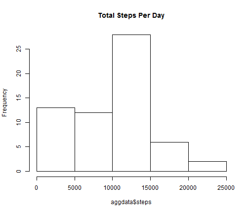
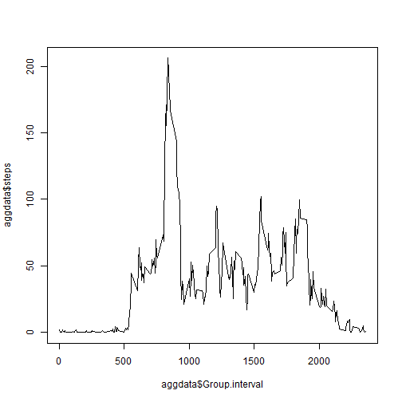
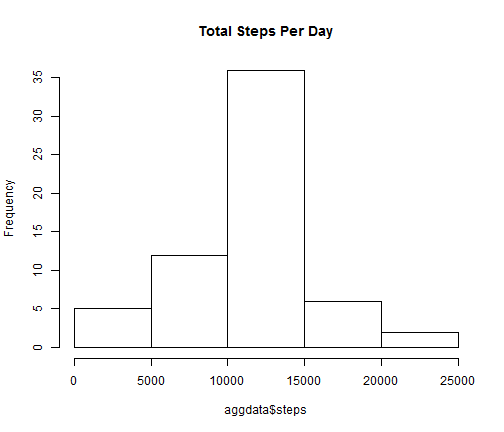
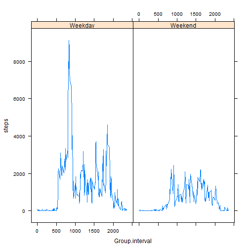

Project 1
========================================================

This is my Project 1 for Reproducible Research.

### Loading and preprocessing the data

Below is how I loaded in the data.


```r
mydata = read.csv("activity.csv")
dim(mydata)
```

```
## [1] 17568     3
```


First I found the sum of the steps per day after removing records with step value of NA

```r
aggdata <- aggregate(x = mydata[c("steps")], FUN = sum,by = list(Group.date = mydata$date),na.rm=TRUE)
```


### What is mean total number of steps taken per day?

Here's a histogram of those total steps per day


```r
hist(aggdata$steps,main="Total Steps Per Day")
```

 

Here's the mean and median of those total steps per day

```r
mean(aggdata$steps)
```

```
## [1] 9354
```

```r
median(aggdata$steps)
```

```
## [1] 10395
```

### What is the average daily activity pattern?

Next I found the average number of steps per 5 minute interval averaged accross all days after removing records with step value of NA


```r
aggdata <- aggregate(x = mydata[c("steps")], FUN = mean,by = list(Group.interval = mydata$interval),na.rm=TRUE)
```

Heres a time series plot of those average steps per interval


```r
plot(aggdata$Group.interval,aggdata$steps,type="l")
```

 

Heres the 5 minute interval with the highest average steps


```r
print(aggdata[aggdata$steps==max(aggdata$steps),c(1:2)],row.names=FALSE)
```

```
##  Group.interval steps
##             835 206.2
```

### Imputing missing values

Heres the total number of records where steps are NA

```r
sum(is.na(mydata$steps))
```

```
## [1] 2304
```

Next I imputed missing values with the overall mean of steps


```r
b = mean(mydata$steps,na.rm=T)
mydata[,"steps"][is.na(mydata$steps)]=b
```

Here I found the sum of the steps per day using the imputed data

```r
aggdata <- aggregate(x = mydata[c("steps")], FUN = sum,by = list(Group.date = mydata$date),na.rm=TRUE)
```

Here's a histogram of total steps per day using the imputed data

```r
hist(aggdata$steps,main="Total Steps Per Day")
```

 

Here's the mean and median of total steps per day using the imputed data. looks like this has a normalizing effect on the distribution.  
it increases the mean and median.

```r
mean(aggdata$steps)
```

```
## [1] 10766
```

```r
median(aggdata$steps)
```

```
## [1] 10766
```

### Are there differences in activity patterns between weekdays and weekends?

Next I created a weekend/weekday variable using non-imputed data

```r
mydata = read.csv("activity.csv")
mydata$day=weekdays(as.Date(mydata$date))
mydata$weekday[mydata$day %in% c("Saturday","Sunday")] = "Weekend"
mydata$weekday[!(mydata$day %in% c("Saturday","Sunday"))] = "Weekday"
table(mydata$weekday,mydata$day)
```

```
##          
##           Friday Monday Saturday Sunday Thursday Tuesday Wednesday
##   Weekday   2592   2592        0      0     2592    2592      2592
##   Weekend      0      0     2304   2304        0       0         0
```

Heres a plot of interval vs total steps by weekday/weekend after removing NA values

```r
aggdata <- aggregate(x = mydata[c("steps")], FUN = sum,by = list(Group.interval = mydata$interval, weekday=mydata$weekday),na.rm=TRUE)
library(lattice)
xyplot(steps~Group.interval|weekday, data=aggdata, type="l")
```

 


